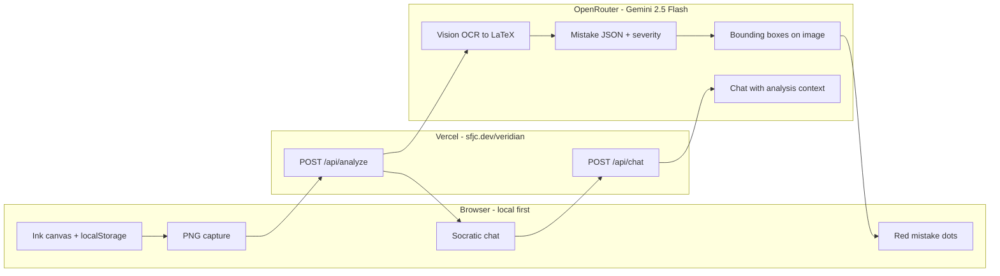

# Video demo — grading rubric alignment

**Live product:** [https://sfjc.dev/veridian](https://sfjc.dev/veridian)  
**Domain fit:** **[2] Application / Product** (architecture + deployment + multimodal AI pipeline — not custom model training or autonomous agents)  
**Target length:** 3–5 minutes (10 min is the cap, not the goal)

> **Agents:** After any whiteboard change, **deploy before recording** — `git push origin main` → `vercel --prod` → `npm run smoke:deploy`. See [WORKING.md](../WORKING.md).

---

## Rubric map

| Question | What graders want | How Veridian answers it |
|----------|-------------------|-------------------------|
| **Q1** Why build this? | Bottlenecks, inspiration | Handwritten math feedback is slow, uneven, and often gives away answers; Veridian closes the loop on **paper-like work** with **Socratic** hints |
| **Q2** How does it work? | Research **or** product **or** agents | **Product:** canvas → PNG → 3-step AI pipeline → red dots → chat (see below) |
| **Q3** Use cases / impact? | Society, who uses it | Independent practice, office hours, homework help without answer leakage |
| **Q4** What more? | Roadmap | Classrooms, teacher rubrics, better OCR, on-device models, analytics |

---

## Q1 — Why did you build this? (≈45 sec)

**Bottlenecks identified**

- **Feedback latency:** Students wait hours/days for graded work; handwriting is hard to search and revisit.
- **Answer leakage:** Traditional tutors and apps often show full solutions, which stops thinking.
- **Spatial mismatch:** Typed math tools (LaTeX editors) don’t match how students actually work on paper/tablets.
- **Platform bloat:** Full LMS (Learning Management System) stacks (accounts, classrooms, databases) block quick iteration on the core loop.

**Inspiration**

- Veridian org vision: AI that **annotates mistakes on handwritten work** and **tutors without giving the answer**.
- v1 deliberately strips EdTech overhead to prove the loop: **draw → analyze → dot → hint**.

**One-liner for video**

> “I built Veridian so a student can write math like on paper, get mistake-specific feedback in seconds, and ask follow-up questions without the app doing their homework for them.”

---

## Q2 — How exactly does the product work? [2] Application / Product (≈90 sec)

### Architecture (say this while showing sfjc.dev/veridian)



### Three-step analysis pipeline (show in UI after “Analyze work”)

1. **OCR (Optical Character Recognition):** Screenshot → LaTeX transcription (vision model).
2. **Mistake analysis:** Compare student work to reference + course context → JSON mistakes with severity (`notational` | `mechanical` | `procedural` | `conceptual`).
3. **Coordinate detection:** Vision model places **red dots** on the image where each mistake occurred.

### Deployment (30 sec — optional terminal slide)

| Layer | Tech |
|-------|------|
| Public URL | [sfjc.dev/veridian](https://sfjc.dev/veridian) (Jon-fun rewrite → `veridian-whiteboard` on Vercel) |
| App | Next.js 16 App Router, `basePath: /veridian` |
| API | Server routes only — keys never sent to browser |
| AI | OpenRouter → `google/gemini-2.5-flash` (single provider for OCR + analysis + chat) |
| Data | **No database** — strokes/analysis/chat persist in `localStorage` |

### Research note (honest framing for [2])

- We use **prompted** multimodal LLMs (Large Language Models), not custom training.
- “Training data” = reference solution text + tutor-behavior context the user edits in the **Context** panel (grading note + Socratic rules).

---

## Q3 — Use cases & impact (≈60 sec)

| User | Use |
|------|-----|
| **Student (solo)** | Check homework before class; ask “why is this wrong?” without seeing the final answer |
| **TA / tutor** | Consistent first pass on handwritten drafts during office hours |
| **Courses with proof-heavy work** | Algebra, calculus, linear algebra — anywhere steps matter |
| **Society** | Scales **formative** feedback; reduces dependency on expensive 1:1 tutoring for routine mistakes |

**Impact framing**

- Faster **learning loops** (mistake → hint → retry) vs. delayed grading.
- **Pedagogy-preserving:** Socratic chat + configurable “do not reveal final answer” context.

---

## Q4 — What more would you add? (≈45 sec)

- Teacher-uploaded rubrics and assignment templates (EdTech path on hold intentionally).
- Stronger handwriting OCR (specialized models or fine-tuning on student samples).
- Confidence scores + “ask human” escalation for low-confidence flags.
- Classroom analytics (which mistake tags are common).
- Offline / on-device stroke analysis for privacy-sensitive schools.
- Integration with Jon-fun hub accounts **only if** needed — v1 stays login-free by design.

---

## Recommended 4-minute video script

| Time | Section | On screen |
|------|---------|-----------|
| 0:00 | **Q1** Problem + why | Face cam or slide; mention bottleneck (slow, leaky feedback) |
| 0:45 | **Q2** Open product | [sfjc.dev/veridian?demo=1](https://sfjc.dev/veridian?demo=1) — demo banner visible |
| 1:00 | Draw wrong work | Intentional error: e.g. `2x+5=13` → subtract 5 from one side only |
| 1:30 | Click **Analyze work** | Show status → red dots → Latest analysis (LaTeX + severity) |
| 2:00 | Click quick action | “Explain this mistake” in chat — show Socratic reply |
| 2:30 | **Q2** Architecture | Mermaid slide or split-screen: browser / Vercel / OpenRouter |
| 3:00 | **Q3** Use cases | 2–3 bullets: student, TA, impact |
| 3:30 | **Q4** Roadmap | 3 future items from section above |
| 3:50 | Close | URL on screen: **sfjc.dev/veridian** |

---

## Demo mode (`?demo=1`)

For a repeatable take:

```
https://sfjc.dev/veridian?demo=1
```

- Shows the practice problem and suggested intentional mistake.
- Pre-fills **Reference** and **Tutor behavior** for the rubric narrative.
- You still draw live (authentic) or re-use saved localStorage from a prior take.

---

## Grader checklist (self-score before submit)

- [ ] States **why** (bottleneck), not only features
- [ ] Declares domain **[2] Application/Product**
- [ ] Shows **live** product (not slides only)
- [ ] Explains **3-step pipeline** (OCR → mistakes → coordinates)
- [ ] Mentions **deployment** (sfjc.dev, Vercel, no DB)
- [ ] **Use cases + societal value** explicit
- [ ] **Future work** concrete, not vague
- [ ] Under 10 minutes; aim 3–5
